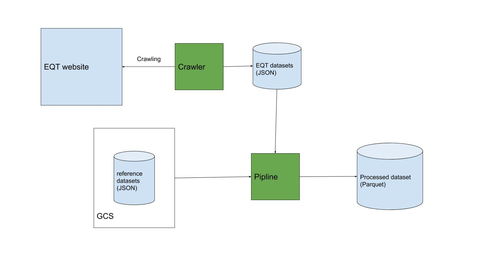

## Project objective

This project enrices EQT portfolio companies (both currently active and dinvested ones) with reference data.

## Solution Architecture



## How to use

### Prerequisites

This python package has been tested against 3.8.6, should be compatible for python 3.5+

Tips: Use [pyenv](https://github.com/pyenv/pyenv) to manage python versions

### Installation

1. Checkout source code

```bash
git@github.com:fuyi/eqt-enrichment-private.git
```

2. Change to project directory

```bash
cd eqt-enrichment-private
```

3. Install python package

```bash
pip install -e .
```

Now the CLI tool `eqt_etl` is ready to use. 

### Usage

Check the usage guideline with 

```bash
eqt_etl --help
```
You should see something similar to this

```
Usage: eqt_etl [OPTIONS]

  CLI tool to enrich EQT portfolio companies data

Options:
  --output_path TEXT      Specify output file path  [default: output]
  --skip_crawler BOOLEAN  Skip web scraping if it has done before  [default:
                          False]

  --debug_mode BOOLEAN    Set to true to enable spark debug log  [default:
                          False]

  --help                  Show this message and exit.
```

To exeute the pipeline with all default options

```bash
eqt_etl
```

If you have already run the crawler before, you can skip the crawling step and run only the processing pipeline

```bash
eqt_etl --skip_crawler=true
```

You can specify where to put the final file

```bash
eqt_etl --output_path=path/to/put/final/dataset
```

Turn on Pyspark debug mode

```bash
eqt_etl --debug_mode=true
```

## Development

### Run tests

Install the package with developlent dependencies

```bash
pip install -e .[tests]
```

Run all tests, using flake8 linter for static check

```bash
pytest --flake8 .
```


### TODOs

* Feature: Add support for more output file formats, json, avro OCR
* Test: Add more tests to increase test coverage
* Fix: schema cast issue for IntegerType 
* Fix: read public file on GCS without authentication